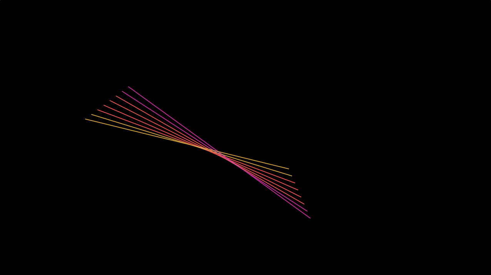
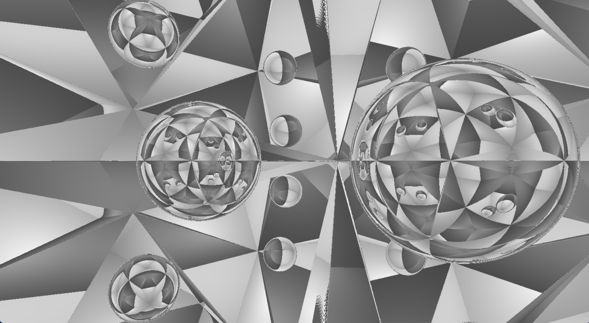

## Shader

*Shaders!*

## Mystify 2

Remember the early Windows screen savers? Theirs drew polygons by default, but I think the line version looks better. Implemented without branching or trig functions. Has an intentionally low framerate to get the retro feel.

Also on [ShaderToy](https://www.shadertoy.com/view/Nlc3WH)

## March 3

Wanted to give ray marching a try. Turned out a bit Escher-esque.

Also on [ShaderToy](https://www.shadertoy.com/view/NlcGR2)

## Acknowledgement

Thanks to [Rabbid76](https://stackoverflow.com/questions/69822784/how-to-run-a-shader-from-shadertoy-in-your-js-file-with-webgl-and-glsl) for sharing their code for moving a Shadertoy shader to a stand-alone page.

## License

MIT
